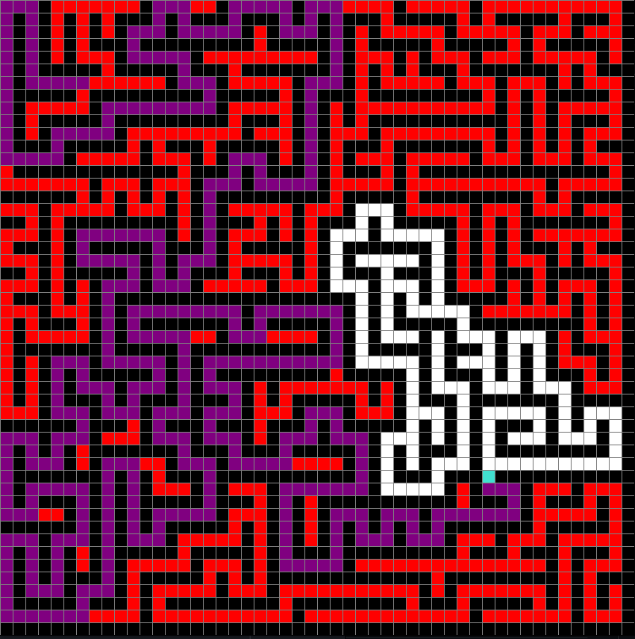

# A* Pathfinding Visualization


## Description

This A* Pathfinding Visualization tool is designed to illustrate the workings of the A* algorithm—a highly efficient and widely used pathfinding and graph traversal algorithm. It visually simulates the process of finding the shortest path between two points, making it an excellent educational tool for students and enthusiasts interested in computer science and algorithmic concepts.

## Features

- Visual representation of the A* algorithm in real-time.
- Customizable grid size and obstacle placement for diverse pathfinding scenarios.
- Dynamic start and end point selections.
- Maze generation for testing the algorithm against complex paths.

## Getting Started

### Prerequisites

Ensure you have Python 3.x installed on your system. You can download Python [here](https://www.python.org/downloads/).

### Installation

Clone the repository to your local machine:

```bash
git clone https://github.com/BohdanBabii/A_star_pathfinding_visualization.git
cd A_star_pathfinding_visualization
```
Install the required dependencies:

```bash
pip install -r requirements.txt
```

### Running the Visualization

To start the visualization, run:

```bash
python main.py
```

## Usage

- Left-click to place or remove obstacles.
- Right-click to select and move the start (green) and end (red) points.
- Press 'Space' to begin the pathfinding.
- Press 'C' to clear the grid and start over.
- Press 'M' to generate a random maze.
